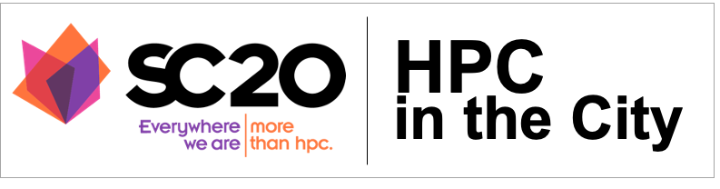
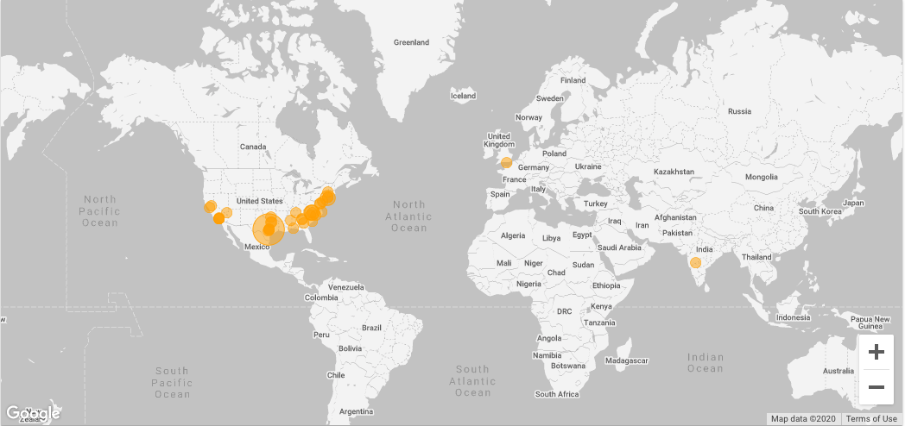

<HEAD>
  
</HEAD>
 

  <strong>Special thanks to this years sponsors!</strong> 
  <a href="http://www.omnibond.com/">Omnibond</a> |
  <a href="http://www.intel.com">Intel</a> |
  <a href="https://cloud.google.com/">Google</a> |
  <a href="http://tacc.utexas.edu">TACC</a> |
  <a href="https://www.globus.org/">Globus Online</a> |
  <a href="http://https://www.sighpc.org/">SigHPC</a> |
  <a href="https://sciencegateways.org/">SGCI</a>

## Code of Conduct
_All attendees, sponsors, partners, volunteers and staff at our hackathon are required to agree with the following code of conduct. Organizers will enforce this code throughout the event. We expect cooperation from all participants to ensure a safe environment for everybody._
- [https://sciencegateways.org/engage/hackathon/hackathon-code-of-conduct](https://sciencegateways.org/engage/hackathon/hackathon-code-of-conduct)
  - [Video Presentation](https://youtu.be/4P8sEZDsKaQ)
  - [Organizing Committe Contact Information](#organizers-contact-information)

## Schedule of Events - November 5th - 9th

| Day | Time | Activities |
|-----------|------------------------|----------------------------|
| Thursday (11/5) | 6:00p(EST) 5:00p(CT) 3:00p(PT) |  **Kickoff Meeting**   • Omnibond Overview   • Dice-Breaker   • Ethics   • Schedule   • Google Project Setup [Boyd Wilson](https://www.linkedin.com/in/boydwilson/)   • Team Formation |
| Friday (11/6) | 11:00a(EST) 10:00a(CT) 8:00a(PT) |  **Checkin**   • Virtual Team Introductions - **Prize**    &ensp; ‣ 1 Slide    &ensp; ‣ Team name    &ensp; ‣ Team members including Mentor    &ensp; ‣ Team Theme song    &ensp; ‣ Team Virtual background |
| Friday (11/6) | 3:00p(EST) 2:00p(CT) 12:00p(PT) |  Datasets to DataFrames to Databases   [Anna Dabrowski](https://www.linkedin.com/in/ajdabrowski/) |
| Friday (11/6) | 6:00p(EST) 5:00p(CT) 3:00p(PT) |  **Checkin**   • Globus Overview |
| Saturday (11/7) | 11:00a(EST) 10:00a(CT) 8:00a(PT) |  **Checkin** |
| Saturday (11/7) | 6:00p(EST) 5:00p(CT) 3:00p(PT) |  **Checkin** |
| Sunday (11/8) | 12:00p(EST) 11:00a(CT) 9:00a(PT) |  **Checkin** |
| Sunday (11/8) | 6:00p(EST) 5:00p(CT) 3:00p(PT) |  **Checkin** |
| Monday (11/9) | 11:00a(EST) 10:00a(CT) 8:00a(PT) |  **Checkin** |
| Monday (11/9) | 6:00p(EST) 5:00p(CT) 3:00p(PT) |  **Team Presentations and Awards Ceremony** |

# Datasets
- HackHPC Collection: [Atlanta Datasets](http://hackhpc.org/data/)

## Communication Platforms
- Twitter: [twitter.com/ccloudhack](https://twitter.com/ccloudhack)
- Slack: [cloudhpchack.slack.com](https://cloudhpchack.slack.com)
- Spotify Colaborative Playlist:[HPC in the City Playlist](https://open.spotify.com/playlist/2coSAPXHrSJW87L23J5I5P?si=b4jB4qxvRPWjVMlrXf2ZVg) 
- Zoom Session Links: _TBD_

## Deliverables
**Posted to Slack "#hpcinthecity-hackhq-general" Channel before Presentations**
 <i>Due Monday 11/9 by 6:00p(EST)/5:00p(CT)/3:00p(PT)</i>
 _*NOTE: If not posted by due date and time 20pt automatic deduction from final judging score._

**Github Repository Link Posted to Slack "#hpcinthecity-hackhq-general" Channel**
- Source code Including Comments
- PDF of presentation
  - Team members with pictures
  - Github Link
  - Use of HPC technology in the project
  - Regional (Atlanta) implications of the project

- README.md project description

## Projects

 

- K12 Broadband Access - [Edgar](https://www.linkedin.com/in/edgargarza7/)
- Human Trafficking - [Rich](https://www.linkedin.com/in/richasay/) [(Kyanie)](https://www.linkedin.com/in/kyanie-waters-6a7425146/) 
- Covid-19 Healthcare Support - [LaKeisha](mailto:lakeisharb@gmail.com?subject=[HPC-in-the-City]) [(Charlie)](https://www.linkedin.com/in/charlie-dey-0031317a/) 
- Modeling for Breast Cancer Prediction - [JerNettie](https://www.linkedin.com/in/jaburney/) 
- Covid-19 Impact Prediction - [Caldwell](https://www.linkedin.com/in/rebecca-caldwell-0434256/) (Hector) 
- Traffic Vision Data - [Boyd](https://www.linkedin.com/in/boydwilson/) [(Josh)](https://www.linkedin.com/in/joshua-kissel-201a4895/) 
- Ecorise Gap Analysis - [Jaynell](https://www.linkedin.com/in/jaynell-nicholson/) [(Lissa)](https://www.linkedin.com/in/melissa-pearson-089814103/) 
- Hit and Run Camera Analysis - [Josselyn](https://www.linkedin.com/in/josselyn-salgado-09b582187/) [(JoonYee)](https://www.linkedin.com/in/jychuah/) 
- Pandemic Disease Propagation - [Max](https://www.linkedin.com/in/maxcurie/) 
- Covid impact on Economy in Fulton County, GA - [James](https://www.linkedin.com/in/james-belton-2934226/) 

## Participant Locations

## Organizers Contact Information [Organizing Committee](#organizing-committee)

| Name | Affiliation | Contact Information | Social Media
|-----------------------|--------------|----------------------------|----------------------------|
| Alex Nolte| [University of Tartu]( http://www.ut.ee/en)| [alexander.nolte@ut.ee](mailto:alexander.nolte@ut.ee?subject=[HackHPC-SC20]) | |
| Amy Cannon| [Omnibond]( http://www.omnibond.com/)| [amycannon@omnibond.com](mailto:amycannon@omnibond.com?subject=[HackHPC-SC20]) |  |
| Boyd Wilson| [Omnibond]( http://www.omnibond.com/)| [boyd@omnibond.com](mailto:boyd@omnibond.com?subject=[HackHPC-SC20]) |  |
| Je'aime Powell | [TACC](http://www.tacc.utexas.edu/) | [jpowell@tacc.utexas.edu](mailto:jpowell@tacc.utexas.edu?subject=[HackHPC-SC20]) |  |
| Linda Hayden | [ECSU](http://nia.ecsu.edu/) | [haydenl@mindspring.com](mailto:haydenl@mindspring.com?subject=[HackHPC-SC20]) | |

